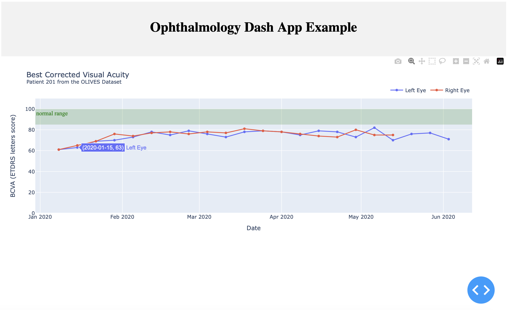

# OPHTHAL-ON-FHIR-DASH
## Description
This repository is intended to demonstrate the access and visualization of ophthalmogical data via FHIR.

## Quickstart
To bootstrap the project, create a virtual environment and install the requirements from ``requirements.txt``:

```shell
virtualenv env
source path/to/env/bin/activate
cd path/to/ophthal-on-fhir-dash/repository
pip install -r requirements.txt
```

### First Example App: Best Corrected Visual Acuity (ETDRS letters score)
For demonstration purposes, a patient from the [OLIVES dataset](https://doi.org/10.48550/arXiv.2209.11195) and their visual acuity examinations were placed on the public HAPI FHIR server (observational resources for both eyes).

To get the Patient resource:
http://hapi.fhir.org/baseR4/Patient/44491871

To get the Observation resources as Bundle.
http://hapi.fhir.org/baseR4/Observation?patient=44491871

[FHIR-PIRATE](https://github.com/UMEssen/FHIR-PYrate) and [pandas](https://pandas.pydata.org) were used to access the FHIR resources and subsequently process the data.

To run the application:

```shell
python app.py
```

The Dash App is available at http://localhost:8050.



Happy testing!